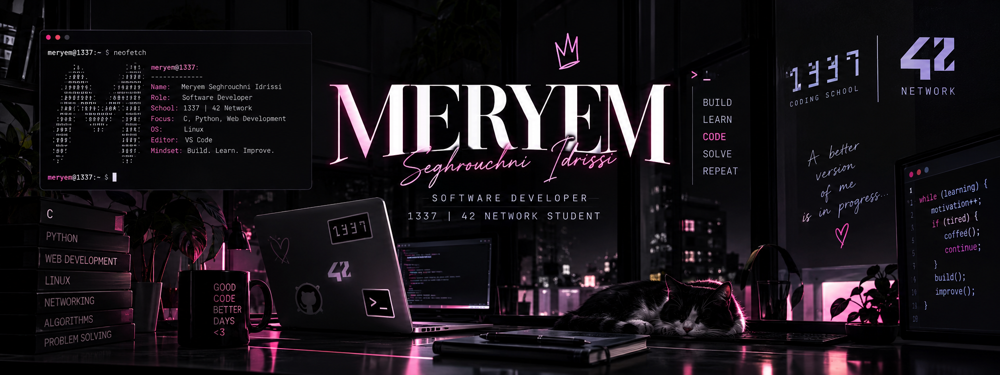

<div align="center">



<br/>


<br/>


</div>

---

## 👩🏻‍💻 About Me

```python
class Meryem:
    def __init__(self):
        self.name = "Meryem Seghrouchni Idrissi"
        self.role = "Software Developer"
        self.school = "1337 | 42 Network"
        self.languages = ["C", "Python", "JavaScript", "TypeScript", "PHP"]
        self.interests = [
            "Software Engineering",
            "Backend Development",
            "Networking",
            "Problem Solving"
        ]

    def current_mission(self):
        return "Build. Learn. Improve. Repeat."


me = Meryem()
```

I'm a **Software Developer** and a student at **1337 Coding School — 42 Network**.

I started my journey through **web development**, building full-stack applications and working with modern web technologies.

Today, I'm also exploring what happens closer to the system level — strengthening my foundations in **C, algorithms, Unix/Linux, networking, and problem solving**.

I enjoy learning by building things, breaking them, understanding why they broke, and making them better.

---

## ⚡ Tech Stack

<div align="center">

### Languages


<br/><br/>

### Frontend


<br/><br/>

### Backend & Databases


<br/><br/>

### Tools & Environment


</div>

---

## 🎓 1337 / 42 Journey

<div align="center">

### Learning through challenges, projects & lots of debugging.

</div>

```text
┌──────────────────────────────────────┐
│            CURRENT FOCUS             │
├──────────────────────────────────────┤
│                                      │
│   ⚙️   C Programming                 │
│   🧠   Algorithms                    │
│   🐧   Unix / Linux                  │
│   🌐   Networking                    │
│   🧩   Problem Solving               │
│   🐍   Python                        │
│                                      │
└──────────────────────────────────────┘
```

<div align="center">


</div>

---

## 🚀 What I'm Working On

- 🎓 Progressing through the **42 / 1337 curriculum**
- ⚙️ Strengthening my foundations in **C programming**
- 🌐 Learning more about **computer networks**
- 🐍 Building projects with **Python**
- 💻 Improving my **software engineering** skills
- 🧠 Practicing algorithms and problem solving

---

## 📊 GitHub Analytics

<div align="center">


</div>

<br/>

<div align="center">


</div>

---

## 🐍 My Contributions

<div align="center">


</div>

---

## 💭 A Little Developer Reminder

<div align="center">

### `while (learning) { build(); fail(); debug(); improve(); }`

<br/>

> *"A better version of me is always in progress."*

</div>

---

## 🌐 Let's Connect

<div align="center">

<a href="https://github.com/meryemSH">

</a>

</div>

<br/>

<div align="center">

### Thanks for visiting my profile! 🖤

`</>` with ☕ by **Meryem**

</div>
